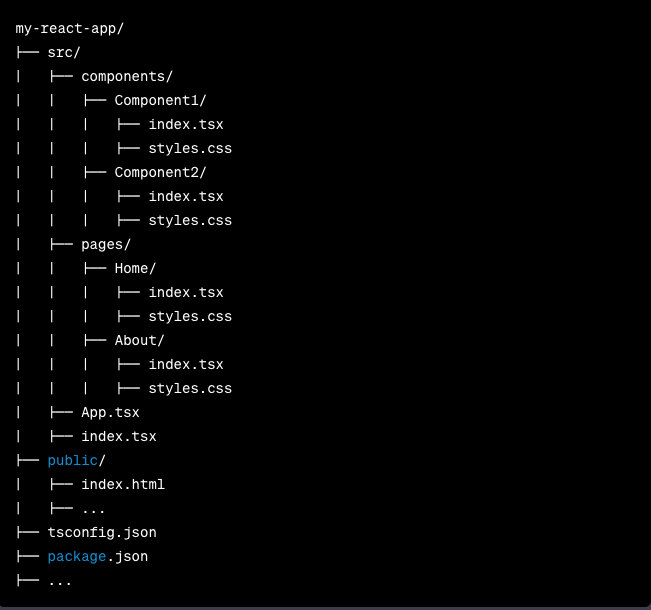

# Project developed to create structure of your projects.

In this example, you will need to adjust the contents of the ```index.tsx`````` file to your needs. Also, keep in mind that the project structure can vary depending on the specific requirements of the language or framework you are using. Be sure to adapt the code as needed to suit your needs.

<p>
This should give you a starting point for automating building your project structure with folders, subfolders and files using Python. If you're working with a React and TypeScript project, you may need to make additional adjustments to meet the requirements of those specific technologies.

### For a React project with TypeScript, a typical directory structure can be organized as shown below:


